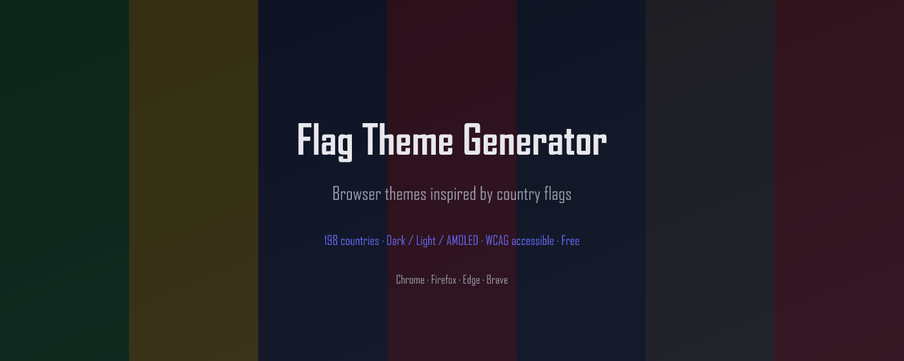

# Flag Theme Generator

Browser themes inspired by country flags — generated from real flag colors with WCAG contrast validation. Chrome, Edge, Firefox. Free, fully local.

[](#)
[](#)
[](#)
[](LICENSE)

## Features

- **198 country palettes** — flag-inspired color themes for every recognized country
- **Dark, Light & AMOLED modes** — three rendering modes per country, switch instantly
- **WCAG contrast validation** — every token pair checked for accessibility, with quality scoring
- **Live browser preview** — see the theme applied to your browser in real time
- **One-click apply** — apply theme directly in Firefox; download .zip for Chrome/Edge
- **Auto-apply by locale** — automatically suggests the theme matching your browser language
- **Design token export** — copy CSS variables, Tailwind config, or JSON tokens for your projects
- **Flag SVG download** — grab any country flag as a clean SVG file
- **Fully local** — no accounts, no analytics, no network requests, no data leaves your browser

## Install

| Browser | Link |
|---------|------|
| Chrome  | *Coming soon* |
| Firefox | *Coming soon* |
| Edge    | *Coming soon* |

You can also download the latest release from [GitHub Releases](https://github.com/investblog/flag-theme-generator/releases).

## Website

Browse all themes online at **[flagtheme.com](https://flagtheme.com)** — 198 countries, 12 languages, instant preview and Chrome theme downloads.

## How it works

Pick a country from 198 flag-inspired palettes. The extension extracts dominant flag colors and generates a full set of design tokens (background, surface, text, accent, border, etc.) using OKLCH color math with configurable strictness. Each token pair is validated against WCAG contrast ratios. Preview the theme live in Dark, Light, or AMOLED mode, then apply it to your browser or export the tokens for web projects.

Firefox applies themes natively via the `browser.theme` API. Chrome and Edge don't expose a theme API to extensions, so the extension links to [flagtheme.com](https://flagtheme.com) where you can download a ready-made `.zip` theme file.

## Development

```bash
git clone https://github.com/investblog/flag-theme-generator.git
cd flag-theme-generator
npm install

npm run dev              # Chrome MV3 dev server with HMR
npm run dev:firefox      # Firefox MV2 dev server
npm run build            # Chrome production build
npm run build:firefox    # Firefox production build
npm run build:edge       # Edge production build
npm run zip:all          # Build + zip all platforms
npm run check            # Typecheck + lint + test
```

## Tech stack

- [WXT](https://wxt.dev) — web extension framework with HMR
- TypeScript strict mode
- Vanilla DOM + CSS custom properties (no framework)
- Chrome MV3 + Firefox MV2 + Edge MV3 builds
- Vitest — unit tests for tokens, contrast, export, palettes, locale
- [Biome](https://biomejs.dev) — linter and formatter
- Zero runtime dependencies

## Project structure

```
src/
├── entrypoints/
│   ├── background/       # Theme API, apply/reset, locale auto-apply
│   ├── welcome/          # Onboarding and full preview
│   └── sidepanel/        # Compact browse/apply/export
├── shared/
│   ├── data/             # 198 country palettes
│   ├── services/         # Storage, locale detection
│   ├── types/            # Theme domain types
│   └── utils/            # Color math, contrast, tokens, export, quality
├── assets/css/           # Theme + layout styles
└── public/
    ├── _locales/         # EN, RU
    └── icons/
site/                     # flagtheme.com static site generator
```

## Contributing

Flag Theme Generator is sponsored by [301.st](https://301.st) — advanced domain management with redirects and traffic distribution.

Found a bug or have a feature idea? [Open an issue](https://github.com/investblog/flag-theme-generator/issues). Pull requests welcome.

## Privacy

Flag Theme Generator makes zero network requests. No analytics, no telemetry, no remote code. Theme preferences are stored in `browser.storage.local` and never leave the browser.

## Related

- [flagtheme.com](https://flagtheme.com) — browse and download themes online (12 languages)
- [Redirect Inspector](https://github.com/investblog/redirect-inspector) — real-time redirect console for developers

## License

[Apache 2.0](LICENSE)

---

Built by [investblog](https://github.com/investblog) at [301.st](https://301.st) with [Claude](https://claude.ai)
